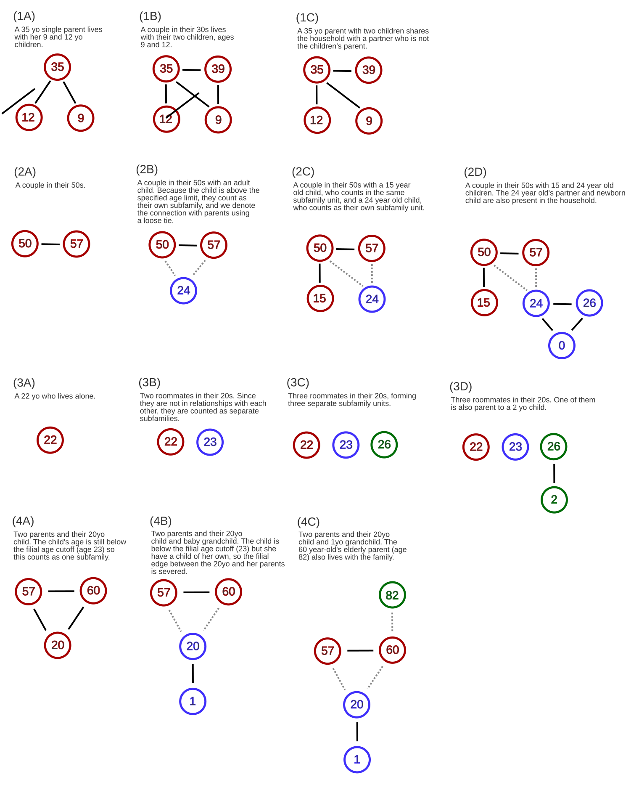

```{r, include = FALSE}
knitr::opts_chunk$set(
  collapse = TRUE,
  comment = "#>"
)
```

```{r setup, message=FALSE, echo = FALSE, include = FALSE}
library(dplyr)

# Load demographr source code (works during development and after installation)
if (requireNamespace("demographr", quietly = TRUE)) {
  library(demographr)
} else {
  devtools::load_all()
}
```

## A Simple Graph-Theoretic Framework for Classifying Household Structure

### High-level overview

A household is a set of people living together in one housing unit. We represent each household as a graph: people are nodes, and edges represent cohabiting relationships. This lets us decompose complex living arrangements into combinations of simpler building blocks, which we call subfamilies. Once households are expressed as combinations of subfamilies, we can describe and compare household living patterns more rigorously—across groups (e.g., by age group) or over time (e.g., 2000 vs. 2019).

This framework separates two related concepts that affect household size and configuration:

- **Within-subfamily patterns** (composition of the core family unit)

  e.g., partnership rates, fertility/child coresidence, single parenthood, living alone

- **Within-household patterns** (how multiple units combine)

  e.g., number of subfamilies, multigenerational living, extended kin, roommates

We know household size differs across groups and over time, but we often don't know which configurations generate those differences. The goal here is to make those configurations measurable.

### Definitions

#### Household

Following the Census, a household is "all the people who occupy a housing unit as their usual place of residence."

#### Graph representation

Each household is represented as an undirected graph:

- **Nodes:** household members
- **Edges:** two edge types
  - **Spousal edge:** a cohabiting partnership (married, common-law, or informal)
  - **Filial edge:** a link between a parent, foster parent, or legal guardian and their cohabiting child

#### Subfamily

A subfamily is a connected component of the household graph after applying a small set of edge-severing rules (below). Intuitively: two people are in the same subfamily if there is a path of partner/parent-child ties connecting them.

Because every household has at least one person, every household has at least one subfamily. We define a household as **doubled up** if it contains two or more subfamilies.

#### Edge-severing rules (to define "independent" subfamilies)

Before computing connected components, we intentionally remove certain parent–child edges:

1. **Age cutoff for "adult children"**
   - If a co-resident child is older than a cutoff (e.g., age 18), we remove the parent–child edge, treating them as able to form an independent subfamily.

2. **Parenthood overrides dependence**
   - If an individual has a child of their own in the household, we remove their parent–child edge to their own parent(s), regardless of age. (This treats "adult child + their child" as its own subfamily.)

Because of rule (2), any three-generation household is necessarily doubled up, but not every doubled-up household is three-generation.

### Relationship to Existing Literature and Contribution

A large literature documents crowded household living arrangements, focusing on rates of doubling up and multigenerational living. Many of these definitions vary slightly based on research context. Our graph-based framework unifies them with a single, flexible representation. Many measures of doubling up and multigenerational living can be expressed as special cases of our subfamily-based definition and differ only in how child independence is operationalized.

#### Doubling up

For example, the definition of "doubled up" used Pilkauskas et al. (2014) and Harvey (2020) perfectly match our subfamily definition, when the cutoff age used to sever filial ties is set at age 18. Mykyta and Macartney (2019) similarly define "shared households", identifying adult children based on school enrollement rather than age. This distinction is easily accommodated in our framework. Harvey et al. (2021) apply a closely related definition of doubling up, but without any age-based cutoff for adult children; this approach can also easily be applied using our framework by completely removing the age-based parent-child severing rule.

Harvey et al (2021) distinguishes guest versus host status within doubled up households, a useful distinction that can illustrate economic and power dynamics in the household. Our framework does not impose host-guest rules by default, but can easily accommodate this labelling using the "householder" or "person one" distinction found in the American Community Survey. Because the householder is defined as the individual in whose name the housing unit is owned or rented, host status can be assigned to the subfamily containing the householder, with all other subfamilies classified as guests.

#### Minimal housing units

Our concept of subfamily parallels "minimal housing units (MHU)" developed by Ermisch and Overton (1984, 1985) and later applied by Lauster and von Bergman (2025). MHUs are normative building blocks of households. Ermisch and Overton define four MHU arrangements: living alone, living as a single parent of dependent children, living as a couple without children, and living as a couple with dependent children. These categories are isomorphic to our subfamily definitions.

#### Other definitions

One notable definition of doubling up that does not map cleanly onto our framework is proposed by Liao and Ortuzar in a doctoral thesis chapter (2024), who define doubled-up spells using longitudinal address histories, identifying periods in which an individual moves into an address already occupied by another resident. Because this definition relies on temporal overlap rather than cross-sectional household composition, it cannot be recovered from a single observation in data such as the ACS.

#### Multigenerational households

Definitions of multigenerational households are generally more consistent across the literature. For example, the Pew Research Center defines multigenerational households as those containing two or more adult generations or a skipped generation (e.g.. a grandparent and grandchild, but no middle generation). In our framework, multigenerational living emerges endogenously from the structure of the household graph: any household with three or more generations after edge severing is classified as multigenerational. By construction, all such households are also doubled up, though not all doubled up households are multigenerational. This clarifies the conceptual relationship between doubling up and multigenerational living, which tend to be studied separately and are rarely unified in the same research literature.

### Subfamily summary statistics

By construction, each subfamily contains at most two generations: an adult generation (generation 0) and, optionally, a child generation (generation 1).

Generation 0 always contains at least one and no more than two individuals. These are the adult(s) who form the core of the subfamily, either as a single adult or a cohabiting pair. If present, generation 1 consists of the cohabiting child(ren) of the generation-0 adult(s). There is no upper bound on the number of children in generation 1.

Single-generation subfamilies include lone adults and adult couples without children (e.g., examples 2A and 3A). Two-generation subfamilies include single-parent and two-parent families with children (e.g., examples 1A, 1B, 1C, and 4A). As illustrated by the contrast between examples 1B and 1C, this vector notation is agnostic to biological relatedness (e.g., blended families).

Much of the structural variation across subfamilies can be captured by a simple two-element vector:

⟨g₀, g₁⟩

where g₀ is the number of individuals in generation 0 and g₁ is the number of individuals in generation 1.

Under this representation:

- A lone adult is written as ⟨1, 0⟩ (example 3A).
- A childless couple is written as ⟨2, 0⟩ (example 2A).
- A single parent with two children is written as ⟨1, 2⟩ (example 1A).
- A two-parent family with two children is written as ⟨2, 2⟩ (examples 1B and 1C).

Note that these categorizations cleanly map onto subcategories that audiences might find meaningful in demographic and housing research - for example, distinguishing single adults from coupled childless adults from single parents from coupled parents (see Ermisch and Overton 1984, 1985, Lauster and von Bergman 2025).

## Canonical household format

All functions in `demographr` operate on a standardized household table with one row per person:

| Column | Description |
|--------|-------------|
| `id` | Unique person ID within household |
| `age` | Age in years |
| `mother_id` | `id` of mother (or `NA`/`0` if absent) |
| `father_id` | `id` of father (or `NA`/`0` if absent) |
| `spouse_id` | `id` of spouse (or `NA`/`0` if absent) |
| `is_hoh` | Indicator for head of household |

**Important notes:**

- IDs reference other rows **within the same household**
- Row order doesn't matter—functions sort internally by `id`
- Both `NA` and `0` are treated as missing relationships
- This format is intentionally survey-agnostic

Here are some example household structures:

```{r, out.width="100%", fig.align="center", echo = FALSE, fig.cap="Example household configurations showing different family structures. Each graph is one household. Each node is one person, with their age in the center. Subfamilies are denoted in different colors. Solid black lines represent filial and spousal edges. Dotted lines represent filial edges that have been severed due to age or due to parenthood."}

```

## A worked example: Two-parent household

Let's walk through a complete example using Example 1B from the diagram above—a household with two parents and two children:

```{r}
hh_nuclear <- tibble(
  id        = c(1, 2, 3, 4),
  age       = c(35, 39, 12, 9),
  sex       = c(2, 1, 1, 2),
  mother_id = c(NA, NA, 1, 1),
  father_id = c(NA, NA, 2, 2),
  spouse_id = c(2, 1, NA, NA),
  is_hoh    = c(1, 0, 0, 0)
)

hh_nuclear
```

**Structure:** Persons 1 and 2 are spouses (ages 35 and 39), and they are the parents of persons 3 and 4 (ages 12 and 9).

We'll use this household to demonstrate each type of adjacency matrix.

### Parent-child edges

`parent_adjacency()` creates directed edges from parent → child. The resulting matrix has entry `mat[i, j] = 1` if person `i` is the parent of person `j`.

```{r}
# Mother-child edges
mother_adj <- parent_adjacency(hh_nuclear, parent_col = "mother_id")
mother_adj
```

Reading this matrix: person 1 (the mother) has edges to persons 3 and 4 (her children).

```{r}
# Father-child edges
father_adj <- parent_adjacency(hh_nuclear, parent_col = "father_id")
father_adj
```

Reading this matrix: person 2 (the father) has edges to persons 3 and 4 (his children).

The `max_age` parameter lets you specify an age threshold for including parent-child edges:

```{r, eval=FALSE}
# Only include children age 18 or younger
parent_adjacency(hh_nuclear, parent_col = "mother_id", max_age = 18)
```

This reflects different definitions of when children are considered independent adults. For example, some research defines dependent children as those under 18, while other studies use 22 or 25. The default is `max_age = Inf`, which includes all parent-child edges regardless of the child's age.

### Spousal edges

`spouse_adjacency()` creates bidirectional edges between spouses. If persons `i` and `j` are spouses, then `mat[i, j] = 1` and `mat[j, i] = 1`.

```{r}
spouse_adj <- spouse_adjacency(hh_nuclear)
spouse_adj
```

Reading this matrix: person 1 and person 2 are spouses, so we have `mat[1, 2] = 1` and `mat[2, 1] = 1`.

### Combined household adjacency

`household_adjacency()` combines all relationship types into a single matrix:

```{r}
# Combines mother + father + spouse edges
hh_adj <- household_adjacency(hh_nuclear)
hh_adj
```

Reading this combined matrix:

- Row 1 has edges to columns 2, 3, 4 (mother → spouse + two children)
- Row 2 has edges to columns 1, 3, 4 (father → spouse + two children)

The function warns if it detects:

- **Self-edges** (non-zero diagonal): Someone listed as their own parent/spouse
- **Values > 1**: Multiple conflicting relationship types between the same two people

## A more complex example

Here's a multigenerational household with seven people:

```{r}
hh_grandfamily <- tibble(
  id        = c(1, 2, 3, 4, 5, 6, 7),
  age       = c(65, 15, 34, 1, 13, 17, 41),
  sex       = c(2, 2, 2, 1, 1, 2, 1),
  mother_id = c(NA, 1, 1, 3, 3, 3, NA),
  father_id = c(NA, NA, NA, 7, 7, 7, NA),
  spouse_id = c(NA, NA, 7, NA, NA, NA, 3),
  is_hoh    = c(1, 0, 0, 0, 0, 0, 0)
)

hh_grandfamily
```

**Structure:**

- Person 1 (age 65): Grandmother, mother of persons 2 and 3
- Person 2 (age 15): Teenage daughter of person 1
- Person 3 (age 34): Adult daughter of person 1, mother of persons 4-6, spouse of person 7
- Persons 4-6 (ages 1, 13, 17): Children of persons 3 and 7
- Person 7 (age 41): Father of persons 4-6, spouse of person 3

Building the adjacency matrix:

```{r}
hh_grandfamily_adj <- household_adjacency(hh_grandfamily)
hh_grandfamily_adj
```

Reading this matrix:

- Row 1 has edges to columns 2 and 3 (grandmother → her two daughters)
- Row 3 has edges to columns 4, 5, 6, and 7 (mother → her three children + spouse)
- Row 7 has edges to columns 3, 4, 5, 6 (father → spouse + his three children)

**Effect of `max_age` parameter:**

```{r}
# Exclude children over age 22
hh_grandfamily_adj_capped <- household_adjacency(hh_grandfamily, max_age = 22)
hh_grandfamily_adj_capped
```

Notice that person 1 no longer has an edge to person 3 (row 1, column 3 is now 0), because person 3 is age 34, which exceeds the cutoff. Person 3 is now treated as an independent adult rather than a dependent child of person 1.

## Visualizing household structure

```{r}
library(igraph)

# Convert to igraph object
g <- graph_from_adjacency_matrix(hh_grandfamily_adj, mode = "directed")

# Add labels with ages
V(g)$label <- paste0(hh_grandfamily$id, "\n(", hh_grandfamily$age, ")")

plot(g, 
     edge.arrow.size = 0.5,
     vertex.size = 30,
     vertex.color = "lightblue",
     main = "Grandfamily Household Structure")
```

## What's next?

Once you have an adjacency matrix, you can:

**1. Identify subfamilies (connected components)**

After applying edge-severing rules (e.g., removing edges to adult children), connected components represent independent family units within the household. We can use `demographr`'s custom function to identify subfamily units and label each member by which one they belong to.

```{r}
# Example: Count connected components
# Count number of connected components in a household adjacency matrix
demographr::count_components(hh_grandfamily_adj_capped)
```

**2. Measure household complexity**

- Number of subfamilies indicates doubling up
- Number of generations indicates multigenerational living
- Subfamily composition (single adults, couples, parents with children)

**3. Comparative analysis**

Compare household structures across groups (e.g., by race, income, immigrant status) or over time to understand what drives differences in household size and composition.

## Scope and limitations

**What `demographr` does:**

- Provides a standardized representation of household structure
- Constructs adjacency matrices from relationship data
- Handles edge cases (missing data, self-edges, conflicting relationships)

**What `demographr` doesn't do:**

- Survey-specific data cleaning (transforming CPS, ACS, or IPUMS data into the canonical format)
- Subfamily identification or edge-severing logic (this may be added in future versions)
- Regression analysis or decomposition methods

This separation keeps the graph logic reusable across datasets while allowing researchers to implement their own definitions of child independence, subfamily boundaries, and analytical approaches.

